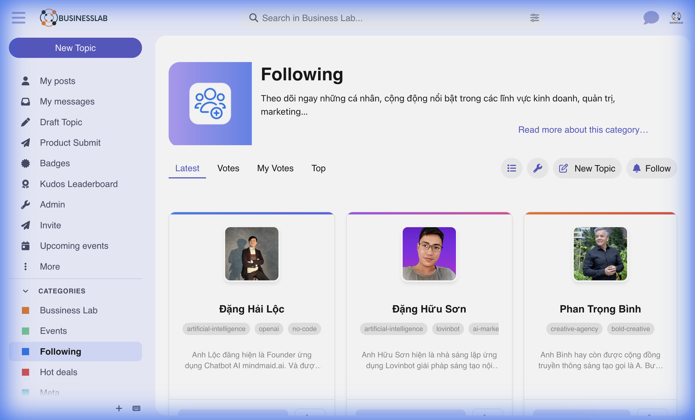

# Following Category Grid - Discourse Theme Component

## 1. Tổng quan (Overview)

**Following Category Grid** là một Theme Component dành cho Discourse, giúp biến đổi giao diện danh sách bài viết (Topic List) mặc định thành dạng **Lưới (Grid View)** hiện đại và trực quan. 

Component này được thiết kế đặc biệt cho các danh mục cần nhấn mạnh vào **Profile cá nhân** hoặc **Nội dung nổi bật** (ví dụ: danh mục "Following", "Experts", "Showcase"), nơi mà hình ảnh và thông tin tóm tắt quan trọng hơn là các chỉ số thảo luận truyền thống.

## 2. Tính năng Nổi bật (Features)

### 🎨 Bố cục Lưới Hiện đại (Modern Grid Layout)
*   **100% CSS Grid**: Không phụ thuộc vào Javascript để tính toán laytout, đảm bảo hiệu năng cao.
*   **Auto Responsive**: Tự động điều chỉnh số cột hiển thị tối ưu cho mọi thiết bị:
    *   **Mobile**: 1 cột (Dạng thẻ Feed).
    *   **Tablet**: 2 cột.
    *   **Desktop**: 3 cột.

### 🃏 Giao diện Thẻ Thông minh (Smart Cards)
Mỗi bài viết được hiển thị dưới dạng thẻ với đầy đủ thông tin:
*   **Auto Thumbnail**: Tự động lấy hình ảnh đầu tiên trong bài viết làm ảnh đại diện.
*   **Deterministic Gradient**: Mỗi thẻ có một header màu gradient riêng biệt dựa trên ID bài viết, tạo điểm nhấn thị giác mà không cần cấu hình thủ công.
*   **Metadata**: Hiển thị Tên, Mô tả ngắn (Excerpt) và Tags.

### 🖱️ Tương tác Nâng cao (Interactive Actions)
*   **Nút Voting/Follow**: Tích hợp trực tiếp khả năng Vote (Upvote) ngay trên thẻ.
    *   Trạng thái chưa Vote: Nút "Theo dõi".
    *   Trạng thái đã Vote: Nút "Đang theo dõi" (Highlight màu xanh).
*   **Bộ đếm**: Hiển thị số lượng người đang theo dõi/vote.
*   **Đa ngôn ngữ (I18n)**: Toàn bộ văn bản (Follow, Following) có thể tùy chỉnh dễ dàng trong phần Admin > Customize > Text.

### 🏷️ Điều hướng Tags (Smart Tag Navigation)
*   **Drag-to-Scroll**: Danh sách Tag hỗ trợ thao tác **kéo ngang** để xem thêm trên Desktop (tương tự trải nghiệm Mobile App).
*   **Smart Click**: Hệ thống tự động phân biệt giữa thao tác "Kéo" và "Click" để tránh điều hướng nhầm.

## 3. Cài đặt & Cấu hình (Installation & Configuration)

### Yêu cầu
*   Core Discourse mới nhất.
*   Plugin `discourse-topic-thumbnails` (Khuyến nghị để hỗ trợ render thumbnail tốt nhất).

### Cấu hình Theme Setting
Sau khi cài đặt, vào **Theme Settings** của component:

*   `following_grid_category`: Chọn các danh mục bạn muốn áp dụng giao diện Grid. Hệ thống hỗ trợ chọn nhiều danh mục.

## 4. Kiến trúc Kỹ thuật (Technical Implementation)

*   **Plugin Outlet**: `discovery-list-container-top`.
*   **Tech Stack**: Glimmer Component (Ember.js), Modern CSS Grid, Discourse API.
*   **State Management**: Sử dụng `service:router` và `service:discovery` để đồng bộ trạng thái.

---
*Developed for BusinessLab.vn*
